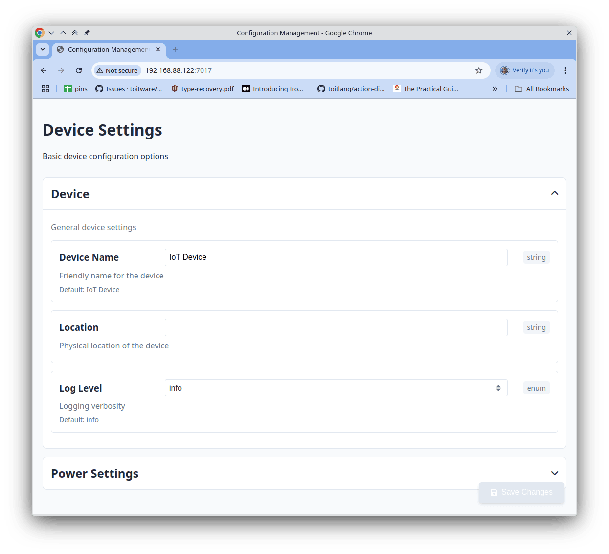
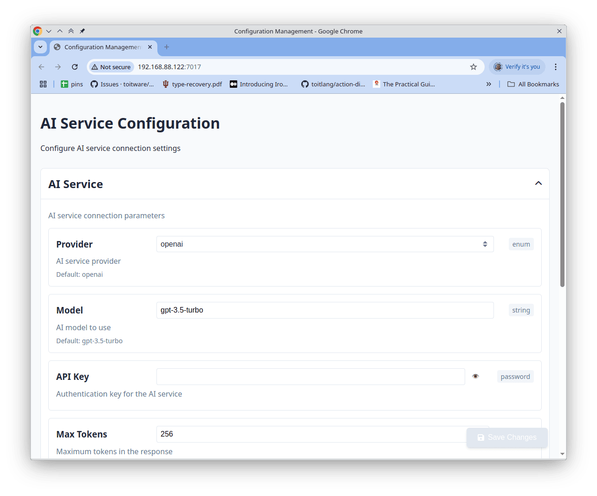

# Simple Config

A package to configure devices through a web interface.

The configuration options are specified using a JSON schema, and the package
  provides a web interface to edit the configuration.

## Supported types

The following types are supported in the configuration schema:

- **String**: Basic text fields. Supports special formats:
  - `uri`: For URL inputs with validation
  - `password`: For sensitive information (displayed as obscured text)

  ```json
  "server_url": {
    "type": "string",
    "title": "Server URL",
    "description": "API endpoint URL",
    "format": "uri",
    "default": "https://api.example.com"
  },
  "api_key": {
    "type": "string",
    "title": "API Key",
    "description": "Authentication key",
    "format": "password"
  }
  ```

- **Integer/Number**: Numeric values with optional constraints
  - Can specify `minimum`, `maximum`, and `default` values

  ```json
  "timeout": {
    "type": "integer",
    "title": "Timeout",
    "description": "Connection timeout in seconds",
    "minimum": 1,
    "maximum": 120,
    "default": 30
  },
  "threshold": {
    "type": "number",
    "title": "Threshold",
    "description": "Sensor threshold value",
    "minimum": 0.0,
    "maximum": 10.0,
    "default": 5.5
  }
  ```

- **Boolean**: True/false toggle fields

  ```json
  "enabled": {
    "type": "boolean",
    "title": "Enable Feature",
    "description": "Whether the feature is enabled",
    "default": true
  }
  ```

- **Object**: Grouping of related configuration options
  - Can be nested to create hierarchical configurations
  - Support for the `folded` property to collapse sections by default

  ```json
  "network": {
    "type": "object",
    "title": "Network Settings",
    "description": "Network configuration options",
    "folded": true,
    "properties": {
      "hostname": {
        "type": "string",
        "title": "Hostname",
        "default": "device-1"
      },
      "retry": {
        "type": "integer",
        "title": "Retry Count",
        "default": 3
      }
    }
  }
  ```

- **Array**: Lists of values
  - Configured via the `items` property to define the type of elements
  - Supports `minItems` and `maxItems` for size constraints

  ```json
  "data_points": {
    "type": "array",
    "title": "Data Points",
    "description": "List of measurement values",
    "items": {
      "type": "number",
      "title": "Value"
    }
  }
  ```

- **Enum**: Selection from predefined options
  - Using the `enum` property with an array of possible values

  ```json
  "log_level": {
    "type": "string",
    "title": "Log Level",
    "description": "Application logging level",
    "enum": ["debug", "info", "warning", "error"],
    "default": "info"
  }
  ```

- **Conditional Fields**: Dynamic fields that appear based on other selections
  - Implemented with `oneOf` and `const` constraints

  ```json
  "alert_type": {
    "type": "string",
    "title": "Alert Type",
    "enum": ["email", "sms", "none"],
    "default": "none"
  },
  "oneOf": [
    {
      "properties": {
        "alert_type": { "const": "email" },
        "email_address": {
          "type": "string",
          "title": "Email Address",
          "format": "email"
        }
      }
    },
    {
      "properties": {
        "alert_type": { "const": "sms" },
        "phone_number": {
          "type": "string",
          "title": "Phone Number"
        }
      }
    },
    {
      "properties": {
        "alert_type": { "const": "none" }
      }
    }
  ]
  ```

## Examples

### General Application Configuration

This example shows a configuration with general settings and conditional notification options:

```toit
CONFIG-SCHEMA ::= {
  "title": "Example",
  "description": "Example configuration schema",
  "type": "object",
  "properties": {
    "general": {
      "type": "object",
      "title": "General Settings",
      "description": "General settings for the application",
      "properties": {
        "Frequency": {
          "type": "integer",
          "title": "Frequency",
          "description": "Frequency in seconds for the application to run.",
          "default": 60,
        },
        "Remote": {
          "type": "string",
          "format": "uri",
          "title": "Remote URL",
          "description": "URL to fetch data from.",
          "default": "http://example.com",
        },
      },
    },
    "notification": {
      "type": "object",
      "title": "Notification",
      "description": "Notification end-point.",
      "properties": {
        "type": {
          "type": "string",
          "title": "Type",
          "description": "Type of notification.",
          "enum": [
            "telegram",
            "discord",
          ],
          "default": "telegram",
        },
      },
      "oneOf": [
        {
          "type": "object",
          "properties": {
            "type": {
              "const": "telegram"
            },
            "token": {
              "type": "string",
              "format": "password",
              "title": "Telegram Token",
              "description": "Telegram bot token."
            },
            "password": {
              "type": "string",
              "format": "password",
              "title": "Telegram Password",
              "description": "Telegram password.",
            },
          },
        },
        {
          "type": "object",
          "properties": {
            "type": {
              "const": "discord"
            },
            "token": {
              "type": "string",
              "format": "password",
              "title": "Discord Token",
              "description": "Discord token."
            },
          },
        },
      ],
    },
  },
}

main:
  config := simple-config.Config "flash:toitware.com/toit-simple-config/example" --schema=CONFIG-SCHEMA
  config.serve --port=7017

  task::
    while true:
      config.updated.wait
      values := config.values

      print "Updated values: $values"
```




### AI Service Configuration

This example shows how to configure an AI service endpoint:

```toit
CONFIG-SCHEMA ::= {
  "title": "AI Service Configuration",
  "description": "Configure AI service connection settings",
  "type": "object",
  "properties": {
    "service": {
      "type": "object",
      "title": "AI Service",
      "description": "AI service connection parameters",
      "properties": {
        "provider": {
          "type": "string",
          "title": "Provider",
          "description": "AI service provider",
          "enum": ["openai", "gemini", "mistral", "custom"],
          "default": "openai"
        },
        "model": {
          "type": "string",
          "title": "Model",
          "description": "AI model to use",
          "default": "gpt-3.5-turbo"
        },
        "api_key": {
          "type": "string",
          "format": "password",
          "title": "API Key",
          "description": "Authentication key for the AI service"
        },
        "max_tokens": {
          "type": "integer",
          "title": "Max Tokens",
          "description": "Maximum tokens in the response",
          "minimum": 1,
          "maximum": 4096,
          "default": 256
        },
        "temperature": {
          "type": "number",
          "title": "Temperature",
          "description": "Randomness of the output (0.0-2.0)",
          "minimum": 0.0,
          "maximum": 2.0,
          "default": 0.7
        }
      },
      "oneOf": [
        {
          "properties": {
            "provider": {
              "const": "custom"
            },
            "endpoint_url": {
              "type": "string",
              "format": "uri",
              "title": "Endpoint URL",
              "description": "URL of the custom AI service endpoint"
            }
          },
          "required": ["endpoint_url"]
        },
        {
          "properties": {
            "provider": {
              "enum": ["openai", "gemini", "mistral"]
            }
          }
        }
      ]
    },
    "usage": {
      "type": "object",
      "title": "Usage Settings",
      "description": "Configure AI usage parameters",
      "properties": {
        "cache_responses": {
          "type": "boolean",
          "title": "Cache Responses",
          "description": "Store responses to reduce API calls",
          "default": true
        },
        "rate_limit": {
          "type": "integer",
          "title": "Rate Limit",
          "description": "Maximum API calls per minute",
          "minimum": 1,
          "default": 10
        }
      }
    }
  }
}
```



### Device Settings Example

A simple example with device settings:

```toit
CONFIG-SCHEMA ::= {
  "title": "Device Settings",
  "description": "Basic device configuration options",
  "type": "object",
  "properties": {
    "device": {
      "type": "object",
      "title": "Device",
      "description": "General device settings",
      "properties": {
        "name": {
          "type": "string",
          "title": "Device Name",
          "description": "Friendly name for the device",
          "default": "IoT Device"
        },
        "location": {
          "type": "string",
          "title": "Location",
          "description": "Physical location of the device"
        },
        "log_level": {
          "type": "string",
          "title": "Log Level",
          "description": "Logging verbosity",
          "enum": ["debug", "info", "warning", "error"],
          "default": "info"
        }
      }
    },
    "power": {
      "type": "object",
      "title": "Power Settings",
      "folded": true,
      "description": "Power management configuration",
      "properties": {
        "sleep_mode": {
          "type": "boolean",
          "title": "Enable Sleep Mode",
          "description": "Enable deep sleep to save power",
          "default": true
        },
        "sleep_interval": {
          "type": "integer",
          "title": "Sleep Interval",
          "description": "Time in seconds between wake-ups",
          "minimum": 10,
          "default": 300
        },
        "battery_threshold": {
          "type": "integer",
          "title": "Low Battery Threshold",
          "description": "Battery percentage to trigger low power mode",
          "minimum": 5,
          "maximum": 50,
          "default": 20
        }
      }
    }
  }
}
```


